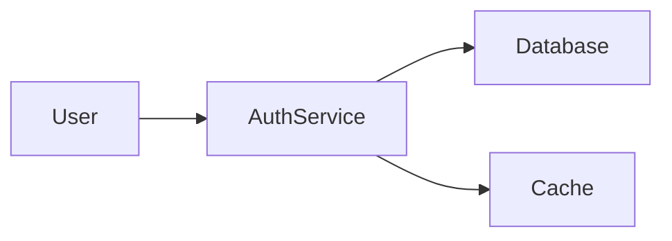

# Your AI diagram looks great and nobody will read it - あなたのAI図は見栄えはいいが誰も読まない
AIが作る“魅せる図”に騙されない！今すぐ覚えたい「テキスト図」の実用性

## 要約
AI生成の図は見栄えは良いが、編集性・検索性・バージョン管理で致命的な欠点があり、ドキュメントにはテキストベースの図（Mermaid等）を使うほうが長期的に有益だ、という主張。

## この記事を読むべき理由
見た目だけで終わる図に時間を浪費せず、実際にチームで使えるドキュメント運用に切り替える方法を知れば、保守性と協業効率が劇的に上がります。日本のエンジニアやプロダクトチームに直結する実務的な話です。

## 詳細解説
- 「slop（スロップ）」という現象：AIが大量に作る図は質や意味が薄いことが多い。魅せる装飾は増えるが、伝わる情報は減る。  
- 画像としての限界：AI出力はほとんどPNGなどの静的画像。誤りを部分修正するには再生成が必要で、同じプロンプトで同じ結果が得られる保証もない。  
- バージョン管理と差分の問題：コードやMarkdownはGitで差分が読み取れるが、画像はバイナリ差分で何が変わったか追いづらい。  
- 検索・再利用性の欠如：画像内のテキストは検索できないため、ドキュメント検索で見つからない。  
- 視覚ノイズ：過剰な装飾は理解の妨げになる。ドキュメントの目的は「伝えること」であり、見栄え最優先はミスマッチ。  
- 代替（テキスト図）の利点：MermaidやPlantUML、Graphvizはテキストで図を定義でき、Gitで差分が追え、誰でも編集可能。再現性がありチーム協業に適する。  
- 実例（Mermaid）：下記のように短いテキストで図を定義できるため、変更も一行差分で済む。

- 端末やプレーンテキスト環境向けにはASCII出力のライブラリもあり（例：beautiful-mermaid）、SlackやPRコメントにも貼れる。

## 実践ポイント
- ドキュメントに載せる設計図はまずMermaid/PlantUML/Graphvizで作る。  
- 図が複雑で画像が必要なら、AI出力は「下書き→トレース→正規の図に落とし込む」扱いにする。  
- リポジトリに図のソース（.md/.mmd/.puml）を置き、生成画像はビルドアーティファクトにする。  
- チームで15分ほどMermaidを学び、テンプレート化して運用を定着させる。  
- ターミナルやプレーンテキストが必要な場面ではASCII出力を活用する（検索性・貼付性が高い）。

以上。ドキュメントは「見せる」ためではなく「伝える」ためにある。ツール選びはそちらを基準に。
